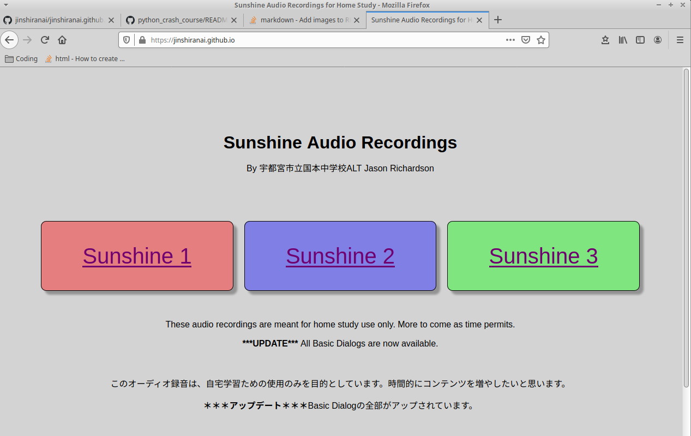

# jinshiranai.github.io

A website I created during the covid-19 school closures so my JHS students could still study at home with their textbooks.
The site streams dialogs from the textbooks saved to my Google Drive that I also recorded and uploaded myself. You can visit the website by [clicking here](https://jinshiranai.github.io).

I specifically started learning programming to make this site for my kids. I saw a problem and used code to fix it. I've since fallen in love with programming, though I have stepped away from front-end/web design for back-end and Python.

